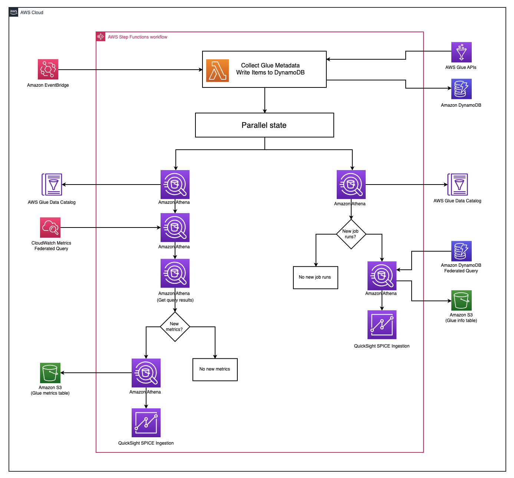

# Glue Metrics in Quicksight

> **NOTE**: This is in conjunction with an AWS blog, for more documentation please see: [Deploy a quicksight dashboard to monitor aws glue ETL job metrics and set alarms](https://aws.amazon.com/blogs/big-data/deploy-a-quicksight-dashboard-to-monitor-aws-glue-etl-job-metrics-and-set-alarms)

Example architecture showing how to collect Glue metrics from both cloudwatch and the Glue API and visualize them in Quicksight. Can be adapted to any use case where you want to collect metrics and information on an event based schedule and visualize it in Quicksight.



## How to Deploy

> **IMPORTANT**: You must enable quicksight and create a quicksight user in the console before deploying this stack. Additionally, all pre-requisites for [deploying via CDK must be met](https://docs.aws.amazon.com/cdk/v2/guide/cli.html) and Docker must be up and running (to build/bundle Lambda code).

```bash
npm install

cdk deploy \
  --parameters BucketName=<bucket-name> \
  --parameters QuicksightUsername=<username>
```

## How to Destroy

```bash
cdk destroy
```

## Security

See [CONTRIBUTING](CONTRIBUTING.md#security-issue-notifications) for more information.

## License

This sample code is licensed under MIT-0.